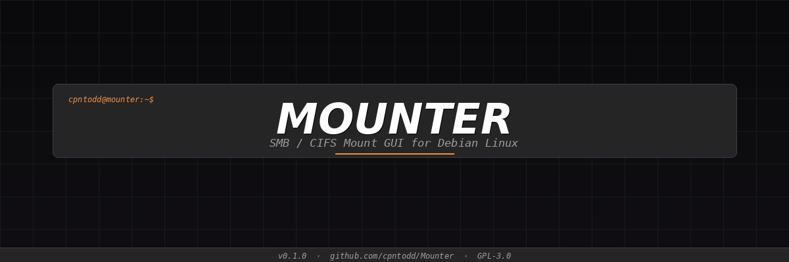
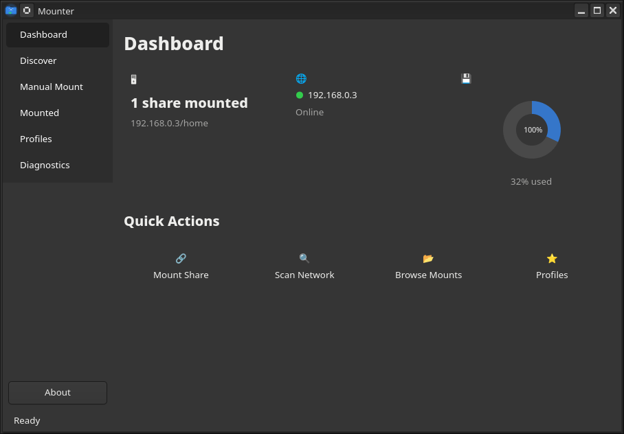
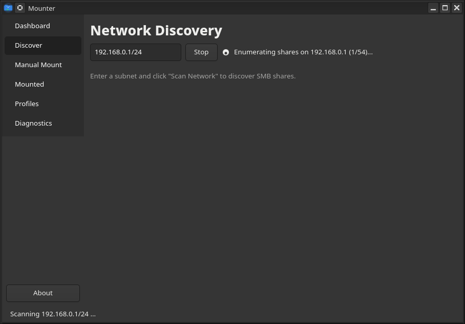
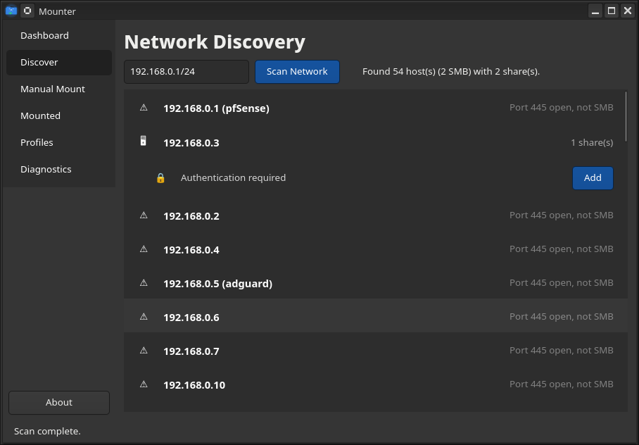
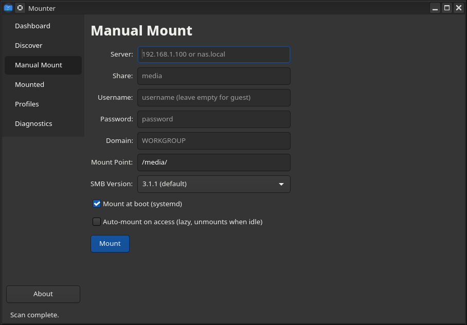
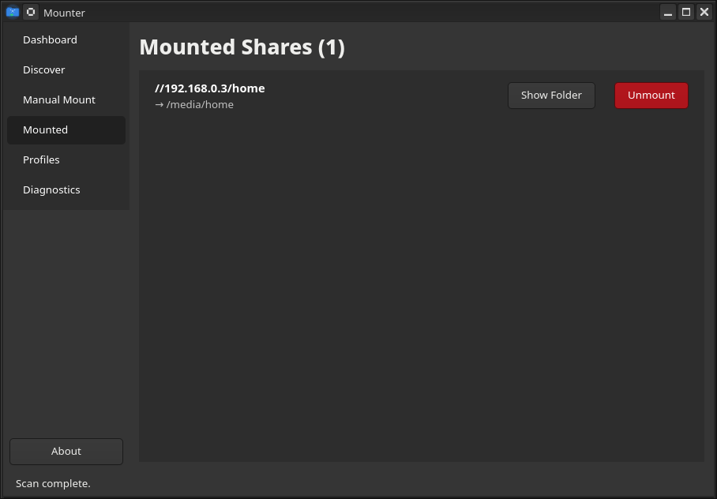
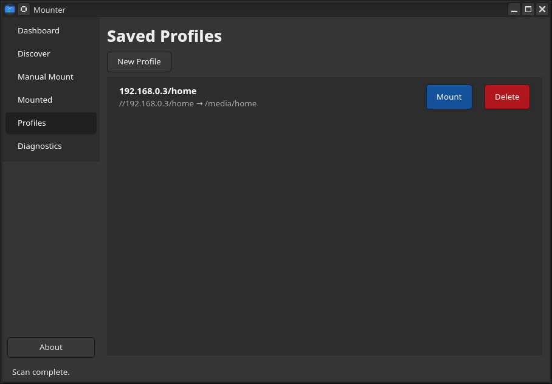
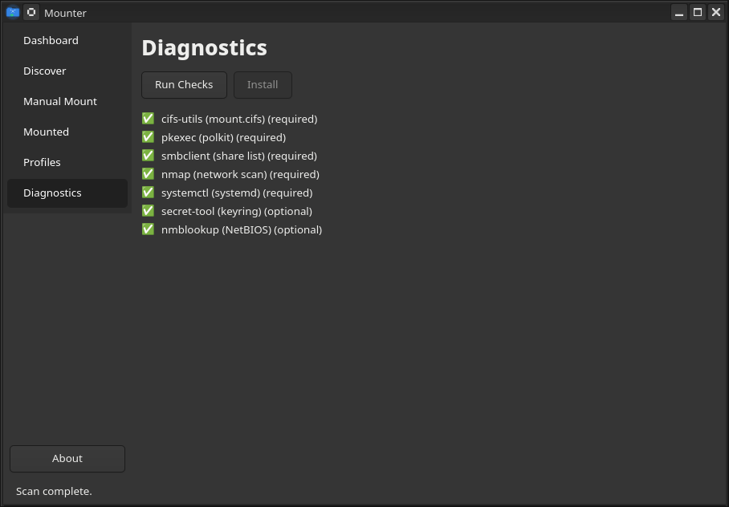
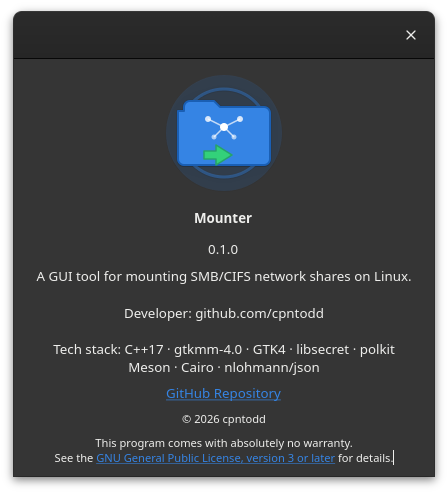

<p align="center">
 
</p>

<h1 align="center">Mounter</h1>

<p align="center">
 
 
 
 
 
 
</p>

<p align="center"><b><i>A GUI tool for mounting SMB/CIFS network shares on Linux.</i></b></p>

---

## INSTALL

```bash
curl -fsSL https://cpntodd.github.io/Mounter/install-mounter.sh | bash
```

**Or via apt repository (Debian 13):**

```bash
echo "deb [signed-by=/etc/apt/keyrings/mounter.asc] https://cpntodd.github.io/Mounter/repo stable main" | \
 sudo tee /etc/apt/sources.list.d/mounter.list
sudo curl -fsSL https://cpntodd.github.io/Mounter/repo/mounter.asc -o /etc/apt/keyrings/mounter.asc
sudo apt update && sudo apt install mounter
```

---

## MAJOR FEATURES

### Network Discovery
Scans your local subnet with `nmap` to find SMB hosts. Lists available shares per host. One-click **Add** prefills the mount form with server info.

### Manual Mount
Complete SMB mount form -- server, share, credentials, SMB version, mount point. Credentials auto-filled from the system keyring. Mount point auto-clones the share name.

### Mounted Shares Management
Live view of all active CIFS mounts. **Show Folder** opens the path in your file manager. **Unmount** disconnects with lazy fallback for stale mounts.

### Persistent Mounts
Two independent persistence options:
- **Mount at boot** -- systemd `.mount` unit with `network-online.target` dependency
- **Auto-mount on access** -- systemd `.automount` unit, mounts lazily, unmounts after idle

### Dashboard
Default start page with live status cards: mounted share count, server reachability (ping indicator), disk usage (Cairo donut chart). Quick-action buttons for all major functions.

### Credential Management
Credentials stored via **libsecret** (GNOME Keyring / Secret Service) with a JSON file fallback. Auto-retrieved when you type a known server+share pair.

### Profiles
Every successful mount auto-creates a profile for one-click reconnection. Profiles persist across sessions in `~/.config/mounter/profiles.json`.

### Diagnostics
Checks for all required and optional system dependencies. **Install** button auto-installs missing packages via `pkexec apt-get install`.

---

## SCREENSHOTS

<details>
<summary>Click to expand -- 9 screenshots</summary>

| | | |
|:---:|:---:|:---:|
|  |  |  |
| *Dashboard* | *Network Scan* | *Share Enumeration* |
|  |  |  |
| *Discovery Results* | *Manual Mount Form* | *Mounted Shares* |
|  |  |  |
| *Saved Profiles* | *Diagnostics* | *About Dialog* |

</details>

---

## SPECS

| Category | Detail |
|:----------|:--------|
| **Language** | C++17 |
| **GUI Toolkit** | gtkmm-4.0 / GTK4 |
| **Build System** | Meson + Ninja |
| **Auth** | polkit + pkexec (passwordless for `sudo` group) |
| **Credential Store** | libsecret (Secret Service) |
| **Persistence** | systemd `.mount` / `.automount` units |
| **Charts** | Cairo (custom `PieChart` widget) |
| **JSON** | nlohmann/json |
| **Target** | Debian 13 (trixie) |
| **Package** | `.deb` (241 KB), Flatpak, APT repo |
| **License** | GPL-3.0-or-later |

---

## BUILD FROM SOURCE

```bash
# Install build dependencies
sudo apt install -y meson libgtkmm-4.0-dev libsecret-1-dev \
 libpolkit-gobject-1-dev nlohmann-json3-dev libadwaita-1-dev

# Clone and build
git clone https://github.com/cpntodd/Mounter.git
cd Mounter
meson setup build
meson compile -C build

# Install
sudo meson install -C build

# Run
mounter
```

### Build .deb package

```bash
ln -sf packaging/debian debian
mkdir -p debian/source && echo "3.0 (native)" > debian/source/format
dpkg-buildpackage -us -uc -b
# produces ../mounter_0.1.0-1_amd64.deb (241 KB)
```

---

## ARCHITECTURE

```

 mounter (GUI) 
 
 Dashboard Discover Mount Mounted 
 Page Page Page Page 
 
 
 Profiles Diagnostic 
 Page Page 
 
 
 
 Core Services 
 MountOperation MountMonitor CredentialStore 
 DiscoveryEngine SystemdManager StyleManager 
 

 pkexec polkit (privilege escalation) 

 mounter-helper (root process) 
 mount · umount · write-cred · write-unit 

```

---

## LINKS

- [GitHub Repository](https://github.com/cpntodd/Mounter)
- [Issues & Bug Reports](https://github.com/cpntodd/Mounter/issues)
- [Developer: cpntodd](https://github.com/cpntodd)

---

<p align="center"><sub> 2026 cpntodd -- GPL-3.0-or-later</sub></p>
